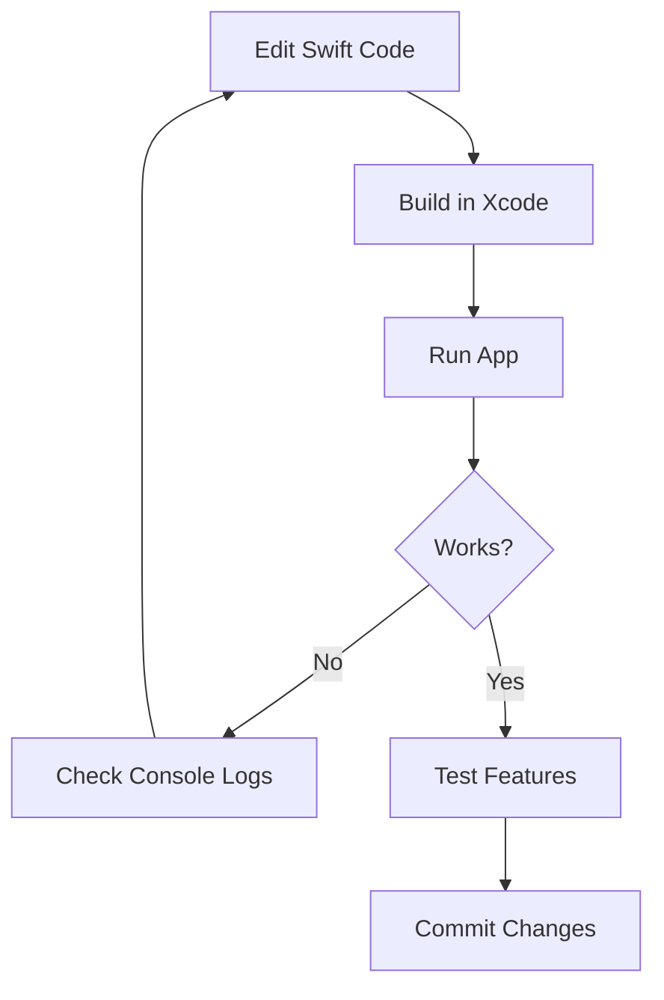

# Quick Start Guide - Voice Assistant Swift App

## For Developers

### 1. Open in Xcode

```bash
cd swift-app
open -a Xcode .
```

Or create Xcode project:
```bash
# See XCODE_SETUP.md for detailed instructions
```

### 2. Build and Run

**Option A: Xcode**
1. Open project in Xcode
2. Select VoiceAssistant scheme
3. Press ⌘R to build and run

**Option B: Swift Package Manager**
```bash
swift build
swift run VoiceAssistant
```

### 3. First Launch

When the app launches:
1. Menu bar icon appears (gray microphone)
2. Microphone permission prompt shows → Grant access
3. Preferences window opens automatically
4. Go to Permissions tab → Grant required permissions

### 4. Test the UI

**Menu Bar**:
- Left-click icon → Activates voice assistant
- Right-click icon → Shows menu

**Preferences**:
- Click icon → Preferences → Configure settings
- Try different LLM backends
- Enter API keys (saved to Keychain)

**Hotkey**:
- Press ⌘⇧Space → Should activate assistant

## For Integration Testing

### Test Python Backend Communication

The Swift app expects Python service at:
```
../python-service/src/voice_assistant/main.py
```

**Mock Python Service for Testing**:

Create `mock_python_service.py`:

```python
#!/usr/bin/env python3
import sys
import json
import time

def send_message(msg):
    print(json.dumps(msg), flush=True)

# On startup
send_message({"type": "status", "status": "idle"})

# Read commands from stdin
for line in sys.stdin:
    try:
        cmd = json.loads(line)

        if cmd.get("command") == "start_listening":
            # Simulate wake word detection
            time.sleep(1)
            send_message({"type": "wake_word"})
            send_message({"type": "status", "status": "listening"})

            # Simulate transcription
            time.sleep(2)
            send_message({"type": "transcription", "text": "Hello Claude"})
            send_message({"type": "status", "status": "processing"})

            # Simulate response
            time.sleep(1)
            send_message({"type": "response", "text": "Hello! How can I help?"})
            send_message({"type": "status", "status": "idle"})

    except Exception as e:
        send_message({"type": "error", "message": str(e)})
```

Run mock service:
```bash
chmod +x mock_python_service.py
python3 mock_python_service.py
```

### Test Message Protocol

**Send command to Python**:
```bash
echo '{"command": "start_listening"}' | python3 mock_python_service.py
```

**Expected output**:
```json
{"type": "status", "status": "idle"}
{"type": "wake_word"}
{"type": "status", "status": "listening"}
{"type": "transcription", "text": "Hello Claude"}
{"type": "status", "status": "processing"}
{"type": "response", "text": "Hello! How can I help?"}
{"type": "status", "status": "idle"}
```

## Common Issues

### App doesn't appear in menu bar

**Fix**: Check Console.app for errors
```bash
log stream --predicate 'process == "VoiceAssistant"' --level debug
```

### Python service not starting

**Fix**: Verify Python path
```swift
// In PythonService.swift, check pythonExecutablePath
which python3
```

### Permissions not working

**Fix**: Reset TCC database
```bash
tccutil reset All com.voiceassistant.macos
```

Then restart app and grant permissions again.

### Xcode build errors

**Fix**: Clean build folder
```
Shift + Command + K (in Xcode)
```

Or:
```bash
swift package clean
```

## File Checklist

Before building, ensure these files exist:

- [x] Sources/App/main.swift
- [x] Sources/App/AppDelegate.swift
- [x] Sources/App/MenuBarController.swift
- [x] Sources/App/PreferencesWindow.swift
- [x] Sources/Permissions/PermissionManager.swift
- [x] Sources/IPC/PythonService.swift
- [x] Sources/Models/Configuration.swift
- [x] Info.plist
- [x] Package.swift

## Next Steps

1. **Read Documentation**:
   - README.md → User guide
   - XCODE_SETUP.md → Xcode configuration
   - IMPLEMENTATION_SUMMARY.md → Architecture details

2. **Add App Icons**:
   - See Resources/Assets.xcassets/README.md
   - Create or download app icons

3. **Integrate with Python Backend**:
   - Wait for Agent 2-6 to complete
   - Test message protocol
   - Verify all status updates work

4. **Test on Real Hardware**:
   - Mac with macOS 14.0+
   - Test all permissions
   - Verify menu bar behavior

5. **Prepare for Distribution**:
   - Code sign with Developer ID
   - Notarize for Gatekeeper
   - Create DMG installer

## Development Workflow



## Testing Checklist

- [ ] App builds without errors
- [ ] Menu bar icon appears
- [ ] Status icon changes colors
- [ ] Preferences window opens
- [ ] All 4 tabs load
- [ ] Permission status shows correctly
- [ ] API keys save to Keychain
- [ ] Backend selection works
- [ ] Configuration saves and loads
- [ ] Launch at login works
- [ ] App quits without crash

## Resources

- [Swift Language Guide](https://docs.swift.org/swift-book/)
- [AppKit Documentation](https://developer.apple.com/documentation/appkit)
- [SwiftUI Tutorials](https://developer.apple.com/tutorials/swiftui)
- [macOS Security](https://developer.apple.com/documentation/security)

## Getting Help

If you encounter issues:

1. Check IMPLEMENTATION_SUMMARY.md for architecture details
2. Read error messages in Console.app
3. Enable debug logging in Preferences → Advanced
4. Check /tmp/voice-assistant/logs/
5. Review test files for examples

---

**Ready to build?** Run `swift build` or open in Xcode!
